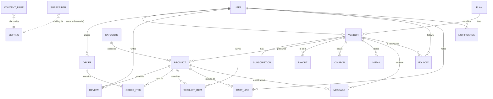

# Data model

Nineteen collections. Ids are UUIDs (`db.uuid()`) except seeded records, which
use readable prefixes (`p-`, `v-`, `o-`) so the demo data is easy to trace.
Every record carries `id`, `createdAt`, `updatedAt`.

## ER diagram



## Entities

### User — `users`
| Field | Type | Req | Rules |
|---|---|---|---|
| id | uuid | ✓ | |
| role | enum | ✓ | `customer` · `vendor` · `admin` |
| vendorId | fk Vendor | — | required when `role = vendor` |
| firstName, lastName | string | ✓ | 1–50 chars |
| email | string | ✓ | valid email, unique, stored lowercase |
| password | string | ✓ | ≥8 chars, ≥1 letter and ≥1 number. **Plaintext in the prototype** — hash server-side |
| avatar | url | — | |
| roleLabel | string | — | shown on reviews, e.g. "3rd Grade Teacher" |
| status | enum | ✓ | `active` · `suspended` |
| resetToken | string | — | one-shot, cleared on use |
| joinedAt | iso | ✓ | |

### Vendor — `vendors`
| Field | Type | Req | Rules |
|---|---|---|---|
| slug | string | ✓ | lowercase, unique, `[a-z0-9-]` |
| storeName | string | ✓ | 3–60 chars, unique by slug |
| owner, email | string | ✓ | |
| planCode | enum | ✓ | `free` · `basic` · `premium` · `publishers` |
| status | enum | ✓ | `pending` · `approved` · `declined` · `suspended`. Starts `pending` (FR-2.4) |
| bio | text | — | 40–600 chars once setup completes |
| logo, banner | url | — | |
| followers | int | ✓ | ≥0, maintained by `toggleFollow` |
| country | string | — | |
| payoutMethod | enum | — | `PayPal` · `Bank deposit`; required before withdrawal |
| payoutAccount | string | — | required with `payoutMethod` |
| setupComplete | bool | — | gates the store-setup wizard |
| declineReason, declineNote | string | — | set on decline, shown to the vendor |
| reviewedBy, reviewedAt | fk/iso | — | audit trail |

### Plan — `plans` (seeded from `business-rules.js`, editable at D-08)
`code`, `name`, `order`, `annualFee`, `priceLabel`, `payoutRate` (0–1),
`transactionFee`, `transactionFeePct`, `paidUploadLimit` (`null` = unlimited),
`allowsPaidListings`, `selfService`, `features[]`.

### Category — `categories`
`slug`, `name`, `tint` (hex), `subjects[]`. Nine live categories (FR-7.1).

### Product — `products`
| Field | Type | Req | Rules |
|---|---|---|---|
| vendorId | fk | ✓ | |
| title | string | ✓ | 10–120 chars |
| description | text | ✓ | ≥80 chars |
| includedHeading | string | — | |
| included | string[] | ✓ | ≥1 item |
| categoryId | fk | ✓ | |
| subject | string | ✓ | must belong to the category |
| resourceType | enum | ✓ | from `RESOURCE_TYPES` |
| gradeFrom, gradeTo | enum | ✓ | from `GRADES`; `gradeTo` ≥ `gradeFrom` |
| theme | enum | — | from `THEMES` |
| price | decimal | ✓ | ≥0, 2 dp. `0` = free. >0 requires a plan that allows paid listings |
| originalPrice | decimal | — | must exceed `price`; drives the discount badge |
| cover | url | ✓ | |
| gallery | url[] | — | up to 5 preview images (FR-5.4) |
| fileType | enum | ✓ | from `FILE_TYPES` |
| pageCount | int | ✓ | ≥1 |
| fileSizeMb | decimal | ✓ | derived from the attached file |
| fileKey, fileName | string | — | IndexedDB blob key + original name |
| tags | string[] | — | |
| status | enum | ✓ | `draft` → `pending` → `approved` · `declined` · `unpublished` |
| downloads | int | ✓ | incremented on each completed order line |
| ratingAvg, ratingCount | number | ✓ | recomputed from reviews |
| ratingBreakdown | object | — | authored 5→1 percentages; seeded design products only |
| publishedAt, submittedAt, lastUpdated | iso | — | |
| declineReason, declineNote | string | — | from `DECLINE_REASONS` |

**Status machine.** `draft --submit--> pending`; `pending --approve--> approved`;
`pending --decline--> declined`; `declined --edit+submit--> pending`;
`approved --edit--> pending` (FR-6.4); `approved --unpublish--> unpublished`.

### Order — `orders`
`reference` (`ULM-#####`, unique), `customerId`, `customerName`, `customerEmail`,
`items[]`, `subtotal`, `discount`, `total`, `couponCode`, `status`
(`completed` · `processing` · `refunded` · `cancelled` · `failed`),
`paymentMethod`, `placedAt`, `refundReason`, `refundedAt`.

**OrderItem** (embedded, immutable snapshot): `productId`, `vendorId`, `title`,
`price`, `cover`, `planCode`, `fileName`, `fileKey`. `planCode` is copied at
purchase time so a later plan change never re-prices a historic settlement.

### Review — `reviews`
`productId`, `userId`, `name`, `roleLabel`, `avatar`, `rating` (int 1–5),
`body` (20–1000 chars), `status`, `createdAt`.
One review per user per product; the user must have a completed order for it.

### Payout — `payouts`
`vendorId`, `period` ("June 2026"), `amount` (≥ `MIN_PAYOUT` 25.00),
`method`, `account`, `status` (`pending` · `processing` · `paid`),
`requestedAt`, `paidAt`.

### Coupon — `coupons`
`vendorId`, `code` (uppercase, unique, 4–20), `type` (`percent` · `fixed`),
`value`, `minSpend`, `usageLimit` (`null` = unlimited), `used`,
`expiresAt`, `status` (`active` · `expired` · `exhausted`).

### Subscription — `subscriptions`
`vendorId` (1:1), `planCode`, `status` (`pending` · `active` · `cancelled`),
`promoActive`, `freeUntil` (2027-01-01), `nextBillingDate` (2027-01-02),
`nextBillingAmount`, `paymentMethod`, `paymentExpiry`, `startedAt`, `cancelledAt`.

### Smaller collections
- **CartLine** `cart` — `userId` (or a `guest-*` id), `productId`. Unique per pair.
- **WishlistItem** `wishlist` — `userId`, `productId`. Unique per pair.
- **Follow** `follows` — `userId`, `vendorId`. Unique per pair; mirrors `Vendor.followers`.
- **Notification** `notifications` — `userId`, `type`, `title`, `body`, `read`, `link`.
- **Subscriber** `subscribers` — `email` (unique), `name`, `confirmed`, `source`.
- **Message** `messages` — `vendorId`, `productId?`, `fromUserId`, `fromName`, `kind` (`message` · `enquiry`), `subject`, `body`, `replies[]`, `status` (`open` · `answered`).
- **Media** `media` — `vendorId`, `kind`, `blobKey`, `name`, `mime`, `sizeMb`.
- **ContentPage** `pages` — `slug`, `title`, `body`, `status`, `updatedAt`.
- **Setting** `settings` — `key`, `value`, `label`, `help`. Keys: `launchMode`, `promoEndsAt`, `billingStartsAt`.

## Derived values — never stored

| Value | Source |
|---|---|
| Vendor gross sales, earnings, commission, fees, withdrawable | `vendorsRepo.vendorStats()` over completed orders |
| Platform commission, AOV, top vendors, monthly series | `platformRepo.platformStats()` |
| Product rating average and distribution | `reviewsRepo.ratingSummary()` |
| Upload allowance and cap messages | `businessRules.uploadAllowance()` |
| Per-line vendor payout and commission | `businessRules.settleLine()` |
| Queue badge counts | `platformRepo.queueCountsSync()` |

## Settlement

`settleLine({ price, planCode })` returns `{ gross, vendorEarnings, commission,
transactionFee }`.

```
share           = gross × plan.payoutRate
transactionFee  = gross × plan.transactionFeePct + plan.transactionFee
vendorEarnings  = max(0, share − transactionFee)     // OI-5: fee off the payout
commission      = gross − share
```

Free products settle to zero across the board.
